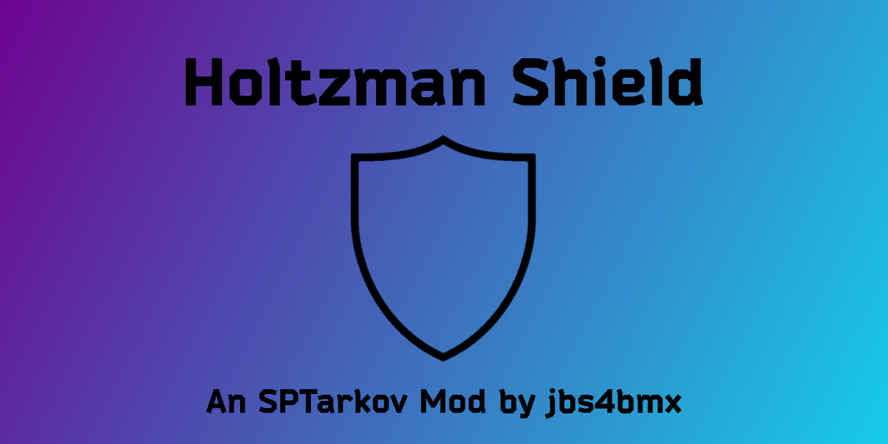

<a id="readme-top"></a>
[![Contributors][contributors-shield]][contributors-url]
[![Forks][forks-shield]][forks-url]
[![Stargazers][stars-shield]][stars-url]
[![Issues][issues-shield]][issues-url]
[![MIT License][license-shield]][license-url]

<!-- PROJECT LOGO -->
<br />
<div align="center">
  <a href="https://github.com/jbs4bmx/HoltzmanShield">
    
  </a>

  <h3 align="center">Holtzman Shield</h3>

  <p align="center">More armor based loosely on the technology from Frank Herbert's Dune!<br /></p>

  [](https://ko-fi.com/X8X611JH15)
</div>


<!-- TABLE OF CONTENTS -->
<details>
  <summary>Table of Contents</summary>
  <ol>
    <li>
      <a href="#about-the-project">About The Project</a>
      <ul>
        <li><a href="#built-with">Built With</a></li>
      </ul>
    </li>
    <li>
      <a href="#getting-started">Getting Started</a>
      <ul>
        <li><a href="#prerequisites">Prerequisites</a></li>
        <li><a href="#installation">Installation</a></li>
      </ul>
    </li>
    <li>
      <a href="#configuration">Configuration</a>
      <ul>
        <li><a href="#mod-faq">Mod FAQ</a></li>
      </ul>
    </li>
    <li><a href="#roadmap">Roadmap</a></li>
    <li><a href="#contributing">Contributing</a></li>
    <li><a href="#license">License</a></li>
    <li><a href="#acknowledgments">Acknowledgments</a></li>
  </ol>
</details>


<!-- ABOUT THE PROJECT -->
## About The Project
Type: Server Mod</br>
Disclaimer: **This mod is provided _as-is_ with _no guarantee_ of support.**

This mod adds a new variant of armband based loosely on the shield technology from the Novel/Movies "Dune". It adds armor protection for body parts as defined in the configuration file. You may alter the level of protection by editing the values found in the 'config.json' file.

Values of **armorCollider** array assigned by Armor mod options.

| Mod Option | Configurable Value | Assigned Value |
|:----- | :----- | :----- |
| Head | true/false | ParietalHead, BackHead, HeadCommon |
| Neck | true/false | NeckFront, NeckBack |
| Eyes | true/false | Eyes |
| Ears | true/false | Ears |
| Jaw | true/false | Jaw |
| Back | true/false | SpineTop, SpineDown |
| Arms | true/false | LeftUpperArm, LeftForearm, RightUpperArm, RightForearm |
| Sides | true/false | RightSideChestUp, RightSideChestDown, LeftSideChestUp, LeftSideChestDown |
| Front | true/false | RibcageUp, RibcageLow |
| Pelvis | true/false | Pelvis |
| Buttocks | true/false | PelvisBack |
| Legs | true/false | RightThigh, RightCalf, LeftThigh, LeftCalf |

<p align="right">(<a href="#readme-top">back to top</a>)</p>


### Built With
| Frameworks/Libraries                                      | Name         | Link                                       |
| :-------------------------------------------------------: | :----------: | :----------------------------------------: |
|       | `TypeScript` | [TypeScript Website][TypeScript-url]       |

|                         IDEs                                |      Name       | Link                                      |
| :---------------------------------------------------------: | :-------------: | :---------------------------------------: |
|        | `VSCode`        | [VSCode Website][Vscode-url]              |

<p align="right">(<a href="#readme-top">back to top</a>)</p>


<!-- GETTING STARTED -->
## Getting Started
This section will explain how to install and use this mod.

### Prerequisites
**This mod requires the [ArmBandCore](https://github.com/jbs4bmx/ArmbandCore/releases) mod to function properly.**</br>
EFT and SPT are required to use this mod.

### Installation
_For the purpose of these directions, "[SPT]" represents your SPT folder path._

Start by downloading the mod from the [Releases](https://github.com/jbs4bmx/HoltzmanShield/releases) page.

Follow these steps to install and configure the mod:
  1. Extract the contents of the zip file into the root of your [SPT] folder.
     - That's the same location as "SPT.Server.exe" and "SPT.Launcher.exe".
  2. Edit the Config to adjust the values to your liking.
  3. Start SPT.Server.exe and wait until it fully loads.
  4. Start SPT.Launcher.exe.
  5. Now you can launch the game and profit.

<p align="right">(<a href="#readme-top">back to top</a>)</p>


<!-- CONFIGURATION EXAMPLES -->
## Configuration
Edit '.\config.jsonc' file as desired. Specify which areas to protect, the amount of protection, and which item you want HS to look like. You can even customize trader pricing and loyalty level requirements to make it easier or harder on yourself to acquire this item.<br>
```jsonc
{
    "ArmorCoverage": {
        // Customize Holtzman Shield armor protection areas.
        // This value must be true or false.
        "Head": true,
        "Neck": true,
        "Eyes": true,
        "Ears": true,
        "Jaw": true,
        "Arms": true,
        "Front": true,
        "Back": true,
        "Sides": true,
        "Pelvis": true,
        "Buttocks": true,
        "Legs": true
    },
    "ArmorAmount": {
        // Customize Holtzman Shield armor durability level.
        // This must be a whole number ranging from 1-9999999.
        "Durability": 100000
    },
    "Resources": {
        // Customize Holtzman Shield item properties.
        "ArmorClass": "10",
        "ArmorMaterial": "Ceramic",
        "ArmorType": "Heavy",
        "ItemWeight": 0.01,

        // This is the amount of protection from bright lights.
        // This must be any number value between 0 and 1 (e.g., 0, 0.25, 0.5, 0.8, 1, etc.)
        "BlindnessProtection": 1,

        // I recommend keeping this at or below 100
        // This must be a whole number ranging from 1-2000.
        "RepairCost": 100,

        // Customize trader (Ragman) properties
        "traderPrice": 1000,
        "traderLoyaltyLevel": 1
    },
    "PreFab": {
        // If more than one is set to 'true', then PreFab will revert to default (Evasion).
        "Evasion": true,
        "Alpha": false,
        "DeadSkul": false,
        "TrainHard": false,
        "TwitchRivals": false,
        "Bear": false,
        "Kiba": false,
        "Labs": false,
        "RFArmy": false,
        "TerraGroup": false,
        "Untar": false,
        "USEC": false,
        "Blue": false,
        "Green": false,
        "Red": false,
        "White": false,
        "Yellow": false,
        "Unheard": false,
        "Arena": false,
        // The following item(s) is(are) not yet part of the game. (WIP - Ignore for now.)
        "BlackDivision": false
    },
    "GodMode": {
        // Disable damage dealt by blunt force trauma.
        "BluntForce": true,

        // (WIP) Disable damage from projectile penetration of armor.
        // This value is a work in progress and is not currently implemented in this mod. - Please ignore for now.
        "Penetration": false
    },
    "Blacklist": {
        // Set to 'true' to disable item spawning on PMC or Scav bots, or to remove from global loot pools.
        "pmc": false,
        "scav": false,
        "globalLoot": false
    }
}
```

<p align="right">(<a href="#readme-top">back to top</a>)</p>

### Mod FAQ
**Q: Where do I report bugs found with the current version of the mod?** <br>
A: You can report bugs for the current version of this mod on the [HS Mod Page](https://hub.sp-tarkov.com/files/file/488-holtzman-shield).

**Q: Why can't I see the different prefab for the armband?** <br>
A: Make sure you only have one of the options set to true. The remaining prefab options should be false. Before you launch the game, be sure to clear (delete) the cache files.

<p align="right">(<a href="#readme-top">back to top</a>)</p>


<!-- ROADMAP -->
## Roadmap
- [X] Add Changelog
- [ ] Fix bugs found/reported in SPT 3.9.5

Suggest changes or view/report issues [here](https://github.com/jbs4bmx/HoltzmanShield/issues).

<p align="right">(<a href="#readme-top">back to top</a>)</p>


<!-- CONTRIBUTING -->
## Contributing
Contributions are what make the open source community such an amazing place to learn, inspire, and create. Any contributions you make are **greatly appreciated**.

If you have a suggestion that would make this better, please fork the repo and create a pull request. You can also simply open an issue with the tag "enhancement".
Don't forget to give the project a star! Thanks again!

1. Fork the Project
2. Create your Feature Branch (`git checkout -b feature/AmazingFeature`)
3. Commit your Changes (`git commit -m 'Add some AmazingFeature'`)
4. Push to the Branch (`git push origin feature/AmazingFeature`)
5. Open a Pull Request

You can also buy me a coffee! (This is not required, but I greatly appreciate any support provided.)</br>
[](https://ko-fi.com/X8X611JH15)

<p align="right">(<a href="#readme-top">back to top</a>)</p>


<!-- LICENSE -->
## License
Distributed under the MIT License. See `LICENSE.txt` for more information.

<p align="right">(<a href="#readme-top">back to top</a>)</p>


<!-- ACKNOWLEDGMENTS -->
## Acknowledgments
Contributors:
  1. [sugonyak](https://hub.sp-tarkov.com/user/24725-sugonyak)
     - Assitance in testing and bug fixes.
  2. [ShadowXtrex](https://hub.sp-tarkov.com/user/16610-shadowxtrex)
     - Assitance in testing and bug fixes.
     - Code optimizations.

<p align="right">(<a href="#readme-top">back to top</a>)</p>


<!-- Repository Metrics -->
[contributors-shield]: https://img.shields.io/github/contributors/jbs4bmx/HoltzmanShield.svg?style=for-the-badge
[contributors-url]: https://github.com/jbs4bmx/HoltzmanShield/graphs/contributors
[forks-shield]: https://img.shields.io/github/forks/jbs4bmx/HoltzmanShield.svg?style=for-the-badge
[forks-url]: https://github.com/jbs4bmx/HoltzmanShield/network/members
[stars-shield]: https://img.shields.io/github/stars/jbs4bmx/HoltzmanShield.svg?style=for-the-badge
[stars-url]: https://github.com/jbs4bmx/HoltzmanShield/stargazers
[issues-shield]: https://img.shields.io/github/issues/jbs4bmx/HoltzmanShield.svg?style=for-the-badge
[issues-url]: https://github.com/jbs4bmx/HoltzmanShield/issues
[license-shield]: https://img.shields.io/github/license/jbs4bmx/HoltzmanShield.svg?style=for-the-badge
[license-url]: https://github.com/jbs4bmx/HoltzmanShield/blob/master/LICENSE.txt


<!-- Framwork/Library URLs -->
[TypeScript-url]: https://www.typescriptlang.org/
[Vscode-url]: https://code.visualstudio.com/
